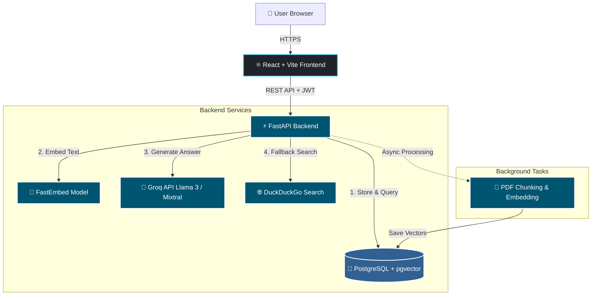
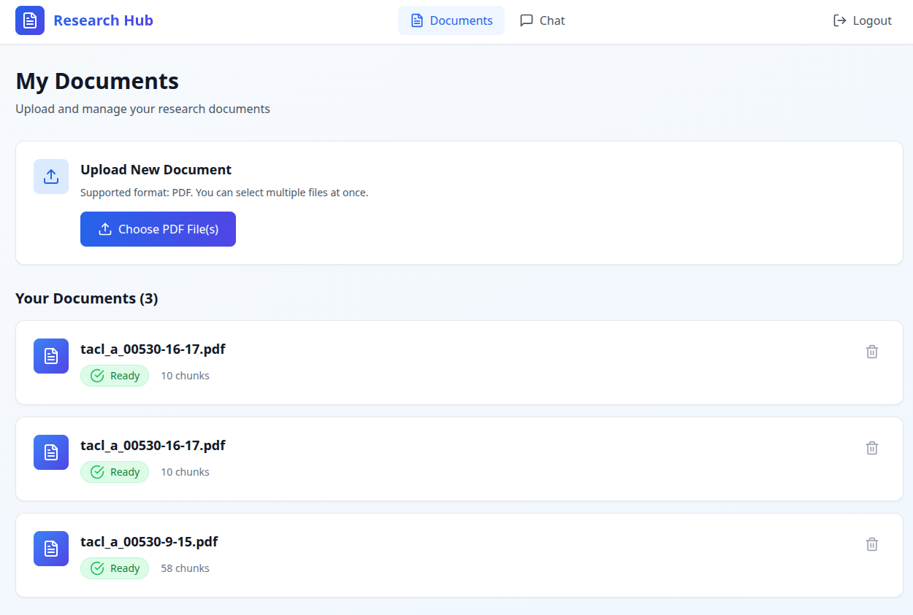
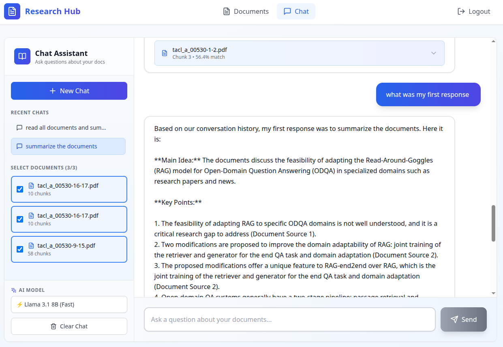

# 📚 Research Hub: AI-Powered Document Assistant

[](https://fastapi.tiangolo.com/)
[](https://reactjs.org/)
[](https://www.postgresql.org/)
[](https://www.docker.com/)

A production-ready, full-stack Retrieval-Augmented Generation (RAG) application. Upload PDFs, and ask questions in natural language. The AI answers with precise source citations, maintains chat memory, and seamlessly falls back to internet search when document context is insufficient.

---

## ✨ Key Features

- 🔐 **Secure Authentication**: JWT-based user registration and login.
- 📄 **Multi-File Upload**: Upload multiple PDFs simultaneously with background processing.
- 🧠 **Advanced RAG Pipeline**: Semantic search using `pgvector` and `fastembed` (BAAI/bge-small-en-v1.5).
- 💬 **Persistent Chat Memory**: Conversations are grouped into sessions with full history retrieval.
- 🌐 **Hybrid Web Search**: Automatically queries DuckDuckGo if document similarity is too low.
- ⚙️ **Dynamic Model Selection**: Switch between Llama 3.1 (8B/70B), Mixtral, and Gemma on the fly via Groq API.
- 🎨 **Modern UI**: Responsive, beautiful interface built with React, Tailwind CSS, and Lucide icons.

---

## 🏗️ System Architecture



---

## 🛠️ Tech Stack

| Category | Technologies |
|----------|-------------|
| Frontend | React 18, Vite, Tailwind CSS, React Router, Lucide React, React Hot Toast |
| Backend | Python 3.12, FastAPI, Uvicorn, SQLAlchemy, Pydantic, uv (package manager) |
| Database | PostgreSQL 16, pgvector extension |
| AI / ML | FastEmbed (BAAI/bge-small), Groq API, DuckDuckGo Search |
| DevOps | Docker, Docker Compose, Nginx (Production Frontend) |

---

## 🚀 Quick Start

### Prerequisites

- Docker Desktop installed and running.
- A free Groq API Key.

### 1. Clone the Repository

```bash
git clone https://github.com/your-username/research-hub.git
cd research-hub
```

### 2. Configure Environment Variables

Create a `.env` file in the root directory (or inside `backend/` depending on your docker-compose setup) with the following:

```env
# Backend Configuration
GROQ_API_KEY=your_groq_api_key_here
DATABASE_URL=postgresql://admin:password123@db:5432/researchhub
SECRET_KEY=your-super-secret-jwt-key-change-in-production
```

### 3. Build and Run

```bash
# Start all services (Database, Backend, Frontend)
docker compose up --build
```

> **Note:** The first build may take 1-2 minutes to download base images and Python/Node dependencies.

### 4. Access the Application

- 🌐 **Frontend UI:** http://localhost:5173
- ⚡ **Backend API:** http://localhost:8000
- 📖 **API Documentation:** http://localhost:8000/docs

---

## 🎬 Demo & Usage Guide

1. **Register:** Navigate to the app and click "Sign Up". Create an account (e.g., `user@test.com`).
2. **Upload:** Go to the Dashboard. Click "Choose PDF File(s)" and select one or multiple research papers.
3. **Wait for Processing:** The document status will show as 🟡 Processing. Within seconds, it will turn 🟢 Ready with a chunk count.
4. **Chat:** Click "Go to Chat".
   - Select the document(s) you want to query from the left sidebar.
   - Choose your preferred AI Model (e.g., Llama 3.1 70B for complex reasoning).
   - Type a question (e.g., "What are the main contributions of this paper?").
5. **Review Sources:** The AI will answer, and you can expand the "Sources" accordion to see the exact text chunks and similarity scores used to generate the answer.
6. **Web Fallback:** If you ask a question unrelated to the uploaded documents, the system will automatically search the internet and append a 🔵 "Searched the internet" badge to the response.




---

## 📂 Project Structure

```
research-hub/
├── backend/
│   ├── app/
│   │   ├── api/            # FastAPI routers (auth, documents, chat)
│   │   ├── core/           # Config, database connection, security
│   │   ├── models/         # SQLAlchemy ORM models
│   │   ├── schemas/        # Pydantic validation schemas
│   │   └── services/       # Business logic (RAG pipeline, web search)
│   ├── requirements.txt    # Python dependencies
│   └── Dockerfile
├── frontend/
│   ├── src/
│   │   ├── components/     # Reusable UI components (Layout)
│   │   ├── pages/          # Route components (Login, Dashboard, Chat)
│   │   └── services/       # Centralized API fetch calls
│   ├── package.json
│   └── Dockerfile
├── db/
│   └── init.sql            # PostgreSQL schema and pgvector setup
├── docker-compose.yml      # Orchestrates all services
└── README.md
```

---

## 🧪 Testing

The backend includes built-in test scripts to verify functionality without the UI:

```bash
# Test Authentication Flow
docker compose exec backend python -m app.test_auth

# Test Document Upload & Processing
docker compose exec backend python -m app.test_upload

# Test RAG Chat Pipeline
docker compose exec backend python -m app.test_chat
```

---

## 🤝 Contributing

Contributions are welcome! Please feel free to submit a Pull Request. For major changes, please open an issue first to discuss what you would like to change.

---

## 📄 License

This project is licensed under the MIT License. See the LICENSE file for details.
